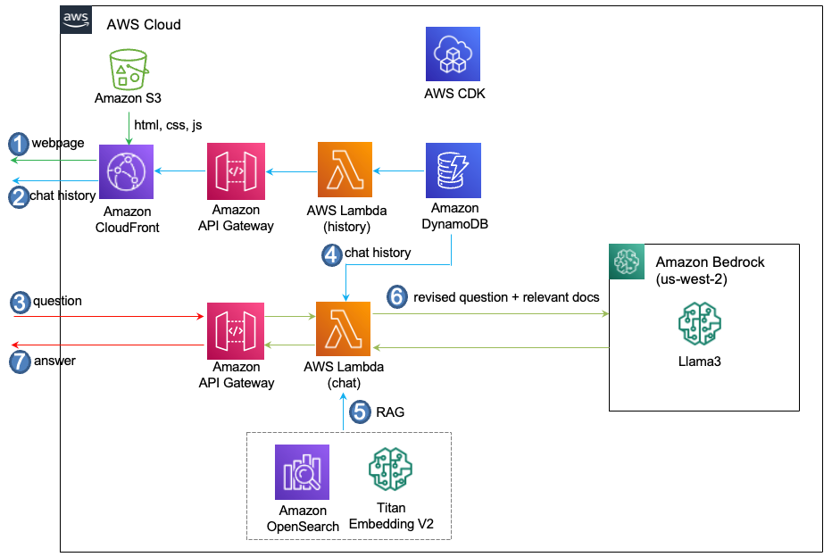

# llama3-rag

전체적인 Architecture는 아래와 같습니다.


   
## System Design

### LangChain

```pyhton
boto3_bedrock = boto3.client(
    service_name='bedrock-runtime',
    region_name=bedrock_region,
    config=Config(
        retries = {
            'max_attempts': 30
        }
    )
)
parameters = {
    "max_gen_len": 1024,  
    "top_p": 0.9, 
    "temperature": 0.1
}    

chat = ChatBedrock(   
    model_id=modelId,
    client=boto3_bedrock, 
    model_kwargs=parameters,
)
```

